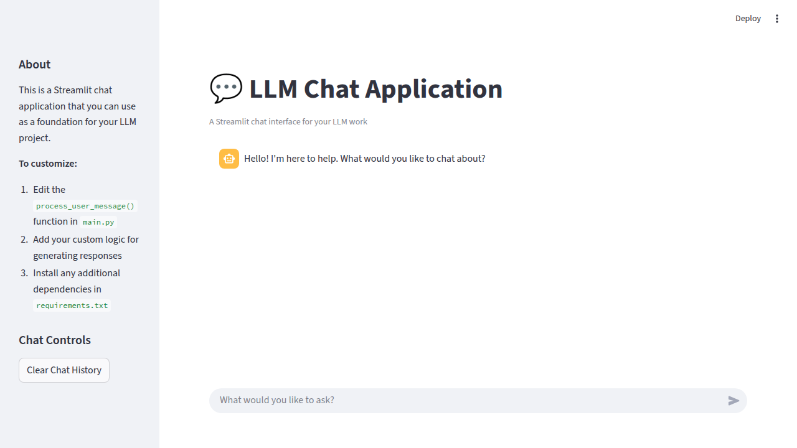
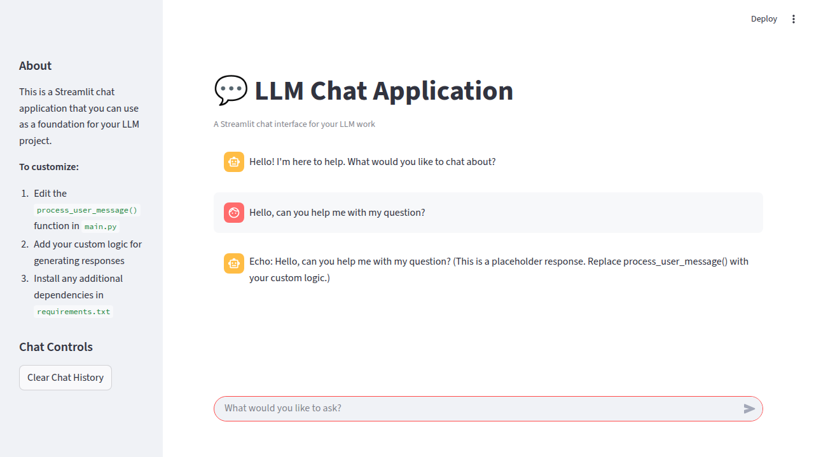

# LLM Trabajo Final - HV Search

Aplicación de chat con Streamlit y recuperación semántica de información usando embeddings y Azure OpenAI.

## Descripción General

Este proyecto permite indexar documentos PDF/TXT, generar embeddings con Azure OpenAI, construir un índice FAISS y consultar información relevante mediante una interfaz de chat.

## Estructura de Archivos

```
llm-trabajo-final-hv-search/
├── main.py                  # Aplicación principal Streamlit (controla el chat y el historial)
├── RagSearch.py             # Lógica de respuesta: consulta FAISS y llama a Azure OpenAI (importar como RagSearch)
├── recuperacion_consulta_faiss.py # Funciones para búsqueda semántica y consulta al índice FAISS
├── indexer.py               # Script para indexar documentos y construir el índice FAISS
├── textManipulation.py      # Utilidades para leer, trocear y procesar textos
├── requirements.txt         # Dependencias Python
├── .env                     # Variables de entorno (no se sube a git, ver .gitignore)
├── README.md                # Este archivo
├── DocumentosPDF/           # Carpeta donde van los PDFs/TXT a indexar
├── faiss_index.faiss        # Índice FAISS generado (no se sube a git)
├── chunks.parquet           # Chunks indexados (no se sube a git)
├── streamlit-chat-app-initial.png
├── streamlit-chat-app-with-conversation.png
└── .gitignore
```

### Archivos principales:
- **main.py**: Interfaz de usuario con Streamlit. Controla el historial de conversación usando `st.session_state` y llama a la función `answer_question` de `RagSearch.py`.
- **RagSearch.py**: Expone la función `answer_question(query, conversation_history)` que busca contexto relevante y genera la respuesta usando Azure OpenAI. No mantiene historial global, sino que recibe el historial desde `main.py`.
- **recuperacion_consulta_faiss.py**: Funciones para cargar el índice FAISS, calcular embeddings y buscar los chunks más relevantes.
- **indexer.py**: Script para procesar los documentos, generar los chunks y embeddings, y construir el índice FAISS. Debe ejecutarse manualmente para actualizar el índice.
- **textManipulation.py**: Utilidades para leer PDFs/TXT y trocear textos en chunks.

### Archivos que no se cargan automáticamente:
- **.env**: Debes crear este archivo con tus credenciales y rutas. Ejemplo:
  ```env
  ENDPOINT=https://pnl-maestria.openai.azure.com/
  DEPLOYMENT=text-embedding-3-small
  AZURE_OPENAI_API_KEY=tu_api_key
  AZURE_OPENAI_API_VERSION=2024-10-21
  ```
  Este archivo está en `.gitignore` y no se sube al repositorio por seguridad.
- **faiss_index.faiss** y **chunks.parquet**: Son artefactos generados por `indexer.py` y requeridos para la búsqueda. No se suben al repositorio y deben generarse localmente.
- **DocumentosPDF/**: Debes colocar aquí los archivos PDF/TXT a indexar. No se suben al repositorio.

## Instalación y Ejecución

1. Instala las dependencias:
    ```bash
    pip install -r requirements.txt
    ```
2. Crea y configura tu archivo `.env` (ver ejemplo arriba).
3. Coloca tus documentos en `DocumentosPDF/`.
4. Ejecuta el indexador para construir el índice:
    ```bash
    python indexer.py
    ```
5. Inicia la aplicación de chat:
    ```bash
    streamlit run main.py
    ```

## Personalización

Puedes modificar la función `answer_question` en `RagSearch.py` para cambiar el prompt, el modelo, o la forma en que se construye el contexto.

## Capturas de Pantalla

### Vista Inicial


### Ejemplo de Conversación


## Contribuir

1. Haz un fork del repositorio
2. Crea una rama para tu feature (`git checkout -b feature/mi-feature`)
3. Haz commit de tus cambios (`git commit -m 'Agrega mi feature'`)
4. Haz push a tu rama (`git push origin feature/mi-feature`)
5. Abre un Pull Request